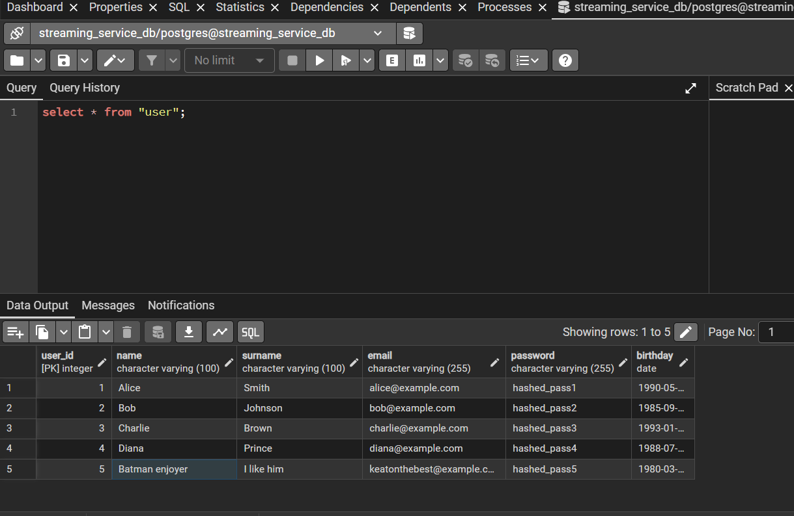
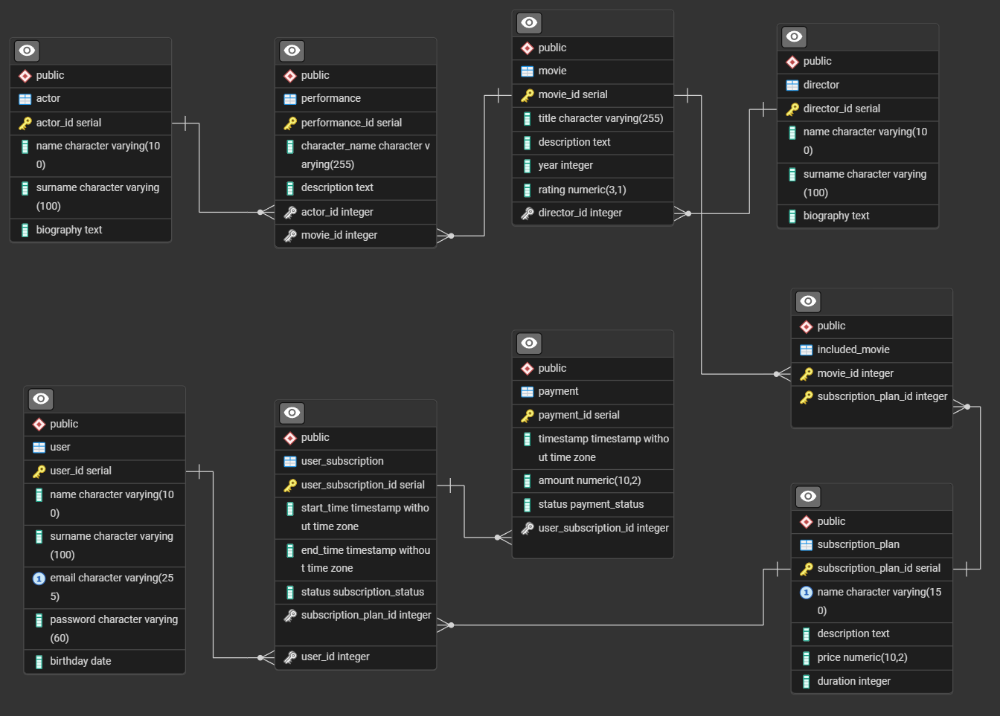

# Netflix like Streaming Service - Database Design 


## Table of Contents

- [Netflix like Streaming Service - Database Design](#netflix-like-streaming-service---database-design)
  - [Table of Contents](#table-of-contents)
  - [**1. Summary of Requirements** (lab 1)](#1-summary-of-requirements-lab-1)
  - [**2. Entities, Attributes, and Relationships**](#2-entities-attributes-and-relationships)
  - [3. Field-Level Constraints](#3-field-level-constraints)
  - [4. System Features](#4-system-features)
  - [SQL scripts (lab 2)](#sql-scripts-lab-2)
  - [Tables information](#tables-information)
  - [Evidence of our hard work 1](#evidence-of-our-hard-work-1)
  - [Evidence of our hard work 2](#evidence-of-our-hard-work-2)
  
## **1. Summary of Requirements** (lab 1)

- **Stakeholder Needs**: The system requires a robust backend to manage a subscription-based streaming service. Key needs to include user account management (registration, login), a comprehensive movie catalog (information on movies, directors, actors), and a complete subscription lifecycle system (plan selection, payment processing, subscription status management).
- **Data to be stored**:
  - **User Data**: User profile information, including names, contact details (email), credentials, and birthdate.
  - **Content Catalog**: Detailed information for movies (title, description, year, rating), directors (biography), actors (biography), and the specific roles (performances) actors played in movies.
  - **Subscription and Financial Data**: Descriptions of available subscription plans (name, price, duration), records of user subscriptions (start/end dates, status), and a history of all payments (amount, timestamp, status).
- **Business Rules**:
  - A movie must have exactly one director, but a director can helm zero or more movies.
  - A movie can feature zero to many actor performances (to accommodate films like animations). An actor can perform in zero or more movies.
  - A user can have zero or many subscriptions over time and can make zero or many payments.
  - A subscription plan can contain many movies, and a single movie can be included in zero or many different plans.
  - Each specific user subscription instance is based on one specific plan.
  - Each payment is made by one user for user subscription.

## **2. Entities, Attributes, and Relationships**

- **Entities: Actor, Performance, Movie, Director, Payment, User, User_Subscription, Subscription_Plan, Included_Movie**

**Attributes:**

- **Actor: (PK)** actor_id, name, surname, biography
- **Performance: (PK)** performance_id, character_name, description, **(FK)** actor_id, **(FK)** movie_id
- **Movie:** movie_id, title, description, year, rating, **(FK)** director_id
- **Director:** director_id, name, surname, biography
- **Incleded_Movie:** **composite PK** (**(FK)** movie_id, **(FK)** subscription_plan_id)
- **Subscription_Plan: (PK)** subscription_plan_id, name, description, price, duration
- **User_Subscription: (PK)** user_subscription_id, start_time, end_time, status, **(FK)** subscription_plan_id
- **Payment: (PK)** payment_id, timestamp, amount, status, **(FK)** subscription_plan_id
- **User: (PK)** user_id, name, surname, email, password, birthday, **(FK)** user_subscription_id

**Relationships:**

- **Actor (one and only one ⇔ zero or many) Performance**

> In a low-budget movie, one actor can play a few roles. An actor can have zero performances if the movie was deleted

- **Movie (one and only one ⇔ zero or many) Performance**
  
> Cartoons don't have actors

- **Director (one and only one ⇔ zero or many) Movie**
  
> A director can have zero movies if the movie was deleted

- **Movie (one and only one ⇔ zero or many) Included_Movie**
  
> A movie can exist on a streaming service but not be included in any subscription

- **Subscription_Plan (one and only one ⇔ one or many) Included_Movie**
- **Subscription_Plan (one and only one ⇔ one and only one) User_Subscription**
- **User_Subscription (one and only one ⇔ zero or many) Payment**
- **User (one and only one ⇔ zero or many) User_Subscription**

## 3. Field-Level Constraints

- **User**

| Field | Type | Constraints |
|-------|------|-------------|
| user_id (PK) | INT | NOT NULL, AUTO_INCREMENT |
| name | VARCHAR(100) | NOT NULL |
| surname | VARCHAR(100) | NOT NULL |
| email | VARCHAR(255) | NOT NULL, UNIQUE |
| password | VARCHAR(60) | NOT NULL, CHECK (LENGTH(password) >= 8 AND LENGTH(password) <= 60) |
| birthday | DATE | NULLABLE |
| user_subscription_id (FK) | INT | NULLABLE |

> **Note:** Password should store a hash, not plaintext

- **Subscription_Plan**
  
| Field | Type | Constraints |
|-------|------|-------------|
| subscription_plan_id (PK) | INT | NOT NULL, AUTO_INCREMENT |
| name | VARCHAR(150) | NOT NULL, UNIQUE |
| description | TEXT | NULLABLE |
| price | DECIMAL(10, 2) | NOT NULL, CHECK (price >= 0) |
| duration | INT | NOT NULL |

> **Note:** Duration in days, e.g., 30 for monthly

- **User_Subscription**

| Field | Type | Constraints |
|-------|------|-------------|
| user_subscription_id (PK) | INT | NOT NULL, AUTO_INCREMENT |
| start_time | DATETIME | NOT NULL |
| end_time | DATETIME | NOT NULL |
| status | VARCHAR(20) | NOT NULL, CHECK (status IN ('active', 'expired', 'cancelled')) |
| plan_id (FK) | INT | NOT NULL |

- **Payment**
  
| Field | Type | Constraints |
|-------|------|-------------|
| payment_id (PK) | INT | NOT NULL, AUTO_INCREMENT |
| timestamp | DATETIME | NOT NULL, DEFAULT CURRENT_TIMESTAMP |
| amount | DECIMAL(10, 2) | NOT NULL, CHECK (amount > 0) |
| status | VARCHAR(20) | NOT NULL, CHECK (status IN ('pending', 'completed', 'failed')) |
| subscription_plan_id (FK) | INT | NOT NULL |

- **Movie**
  
| Field | Type | Constraints |
|-------|------|-------------|
| movie_id (PK) | INT | NOT NULL, AUTO_INCREMENT |
| title | VARCHAR(255) | NOT NULL |
| description | TEXT | NULLABLE |
| year | INT | NOT NULL, CHECK (year > 1880) |
| rating | DECIMAL(3, 1) | NULLABLE, CHECK (rating >= 0.0 AND rating <= 10.0) |
| director_id (FK) | INT | NOT NULL |

- **Director**
  
| Field | Type | Constraints |
|-------|------|-------------|
| director_id (PK) | INT | NOT NULL, AUTO_INCREMENT |
| name | VARCHAR(100) | NOT NULL |
| surname | VARCHAR(100) | NOT NULL |
| biography | TEXT | NULLABLE |

- **Actor**
  
| Field | Type | Constraints |
|-------|------|-------------|
| actor_id (PK) | INT | NOT NULL, AUTO_INCREMENT |
| name | VARCHAR(100) | NOT NULL |
| surname | VARCHAR(100) | NOT NULL |
| biography | TEXT | NULLABLE |

- **Performance**
  
| Field | Type | Constraints |
|-------|------|-------------|
| performance_id (PK) | INT | NOT NULL, AUTO_INCREMENT |
| character_name | VARCHAR(255) | NOT NULL |
| description | TEXT | NULLABLE |
| actor_id (FK) | INT | NOT NULL |
| movie_id (FK) | INT | NOT NULL |

- **Included_Movie**
  
| Field | Type | Constraints |
|-------|------|-------------|
| movie_id (FK, PK component) | INT | NOT NULL |
| subscription_plan_id (FK, PK component) | INT | NOT NULL |

## 4. System Features

- **User can register/login/logout**

- **User can buy subscription => it is requirement to start payment operation (create Payment entity with specific subscription plan) => if payment is success (status) => create new entity User_Subscription related to User with start_time => User can watch films/series (PEREMOGA!!!)**

- **User can cancel Payment or Subscription**

## SQL scripts (lab 2)

> All scripts put to special folder from witch they will copy to database docker image and run after start image

```yml
volumes:
    - ./init_db:/docker-entrypoint-initdb.d
```

1. [Init database tables](\init_db\00_init_tables.sql)

2. [Insert into table director](init_db/01_director.sql)

3. [Insert into table actor](init_db\02_actor.sql)

4. [Insert into table subscription_plan](init_db\03_subscription_plan.sql)

5. [Insert into table movie](init_db\04_movie.sql)

6. [Insert into table performance](init_db\05_performance.sql)

7. [Insert into table included_movie](init_db\06_included_movie.sql)

8. [Insert into table user](init_db\07_user.sql)

## Tables information

> Already mentioned in [lab1](https://github.com/markOone/StreamingService_BD/tree/lab1?tab=readme-ov-file#3-field-level-constraints)

## Evidence of our hard work 1



## Evidence of our hard work 2


