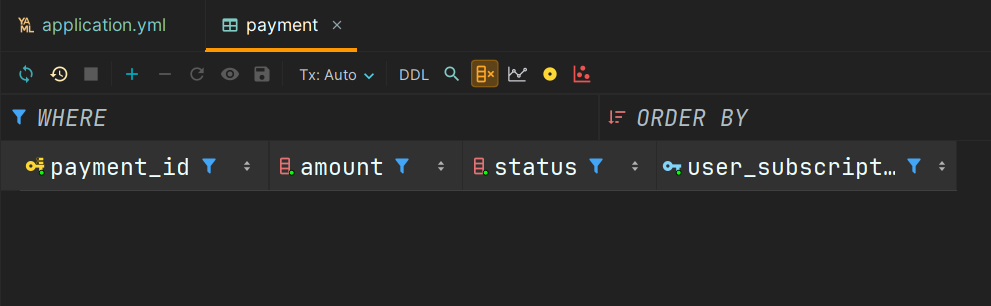
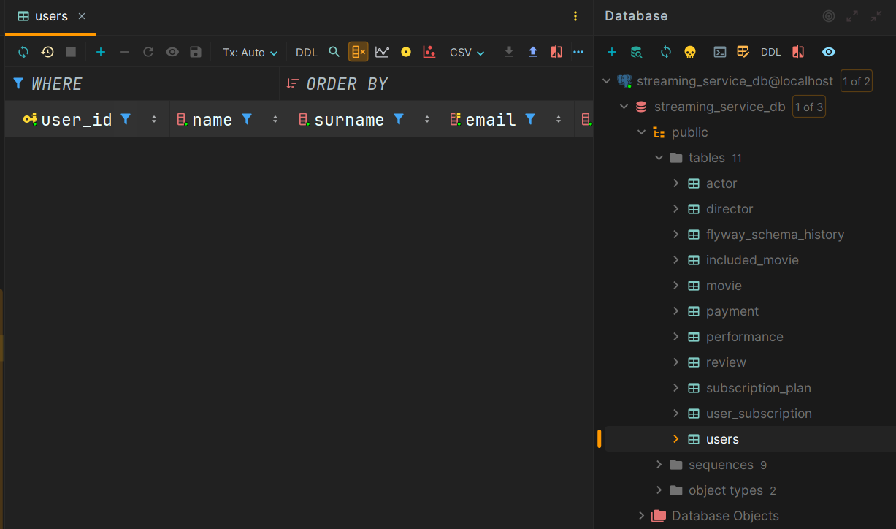
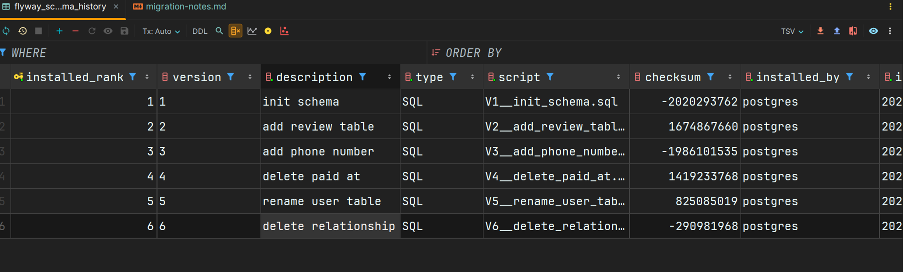

## Міграція V1: Ініціалізація схеми

**Файл:** [`V1__init_schema.sql`](src/main/resources/db/migration/V1__init_schema.sql)

**Опис:** Створення початкової структури бази даних

**Результат:**


-----

## Міграція V2: Додавання нової таблиці

**Файл:** [`V2__add_review_table.sql`](src/main/resources/db/migration/V2__add_review_table.sql)

**Опис:** Створено таблицю `review` для зберігання відгуків користувачів про фільми

**SQL:**

```sql
CREATE TABLE review
(
    review_id  SERIAL PRIMARY KEY,
    rating     INT NOT NULL CHECK (rating BETWEEN 1 AND 10),
    comment    TEXT,
    created_at TIMESTAMP DEFAULT CURRENT_TIMESTAMP,
    movie_id   INT NOT NULL REFERENCES movie (movie_id) ON DELETE CASCADE,
    user_id    INT NOT NULL REFERENCES "user" (user_id) ON DELETE CASCADE
);
```

**Результат:**


-----

## Міграція V3: Зміна наявної таблиці

**Файл:** [`V3__add_phone_number.sql`](src/main/resources/db/migration/V3__add_phone_number.sql)

**Опис:** До таблиці `"user"` додано поле `phone`.

* Поле дозволяє `NULL` задля уникнення конфліктів з наявними записами
* Додано `CHECK constraint` для валідації формату номера телефону

**SQL:**

```sql
ALTER TABLE "user"
    ADD COLUMN phone TEXT NULL;

ALTER TABLE "user"
    ADD CONSTRAINT phone_format CHECK (phone ~ '^\+?[0-9]{10,15}$');
```

**Результат:**


-----

## Міграція V4: Видалення стовпця

**Файл:** [`V4__delete_paid_at.sql`](src/main/resources/db/migration/V4__delete_paid_at.sql)

**Опис:** З таблиці `payment` видалено поле `paid_at`

**SQL:**

```sql
ALTER TABLE payment
    DROP COLUMN paid_at;
```

**Результат:**

+ before


+ after


-----

## Міграція V5: Перейменування таблиці

**Файл:** [`V5__rename_user_table.sql`](src/main/resources/db/migration/V5__rename_user_table.sql)
**Опис:** Таблицю `"user"` перейменовано на `users`

**SQL:**

```sql
ALTER TABLE "user"
    RENAME TO users;
ALTER SEQUENCE user_user_id_seq RENAME TO users_user_id_seq;
```

**Результат:**



-----

## Міграція V6: Видалення зв'язку

**Файл:** [`V6__delete_relationship.sql`](src/main/resources/db/migration/V6__delete_relationship.sql)

**Опис:** Видалено зовнішній ключ та колонку `user_subscription_id` з таблиці `payment`

**SQL:**

```sql
ALTER TABLE payment
    DROP COLUMN user_subscription_id;
```

**Результат:**


-----

## Підтвердження коректності роботи

Для перевірки цілісності даних після всіх міграцій було використано скрипт [`verify_lab6.sql`](scripts/verify_lab6.sql)

+ Перевірка поля phone

    

+ Перевірка зв'язків review

    

+ Перевірка таблиці payment

    

### Flyway schema migration history
> Після виконання всіх міграцій, можемо перевірити, що flyway коректно записав історію змін:


```
1	1	init schema	        SQL	V1__init_schema.sql	       -2020293762	postgres	2025-12-09 13:07:04.493448	79	true
2	2	add review table	SQL	V2__add_review_table.sql	1674867660	postgres	2025-12-09 13:07:04.610111	14	true
3	3	add phone number	SQL	V3__add_phone_number.sql	-1986101535	postgres	2025-12-09 13:07:04.647876	8	true
4	4	delete paid at	    SQL	V4__delete_paid_at.sql	     1419233768	postgres	2025-12-09 13:07:04.672831	6	true
5	5	rename user table	SQL	V5__rename_user_table.sql	825085019	postgres	2025-12-09 13:07:04.696053	6	true
6	6	delete relationship	SQL	V6__delete_relationship.sql	-290981968	postgres	2025-12-09 13:07:04.716304	5	true
```

> Як видно з таблиці історії міграцій, усі скрипти були виконані успішно
під користувачем `postgres`, із збереженням версії, опису, контрольної суми та часу виконання.
Це гарантує відтворюваність схеми бази даних і дозволяє розгортати однакову структуру БД
на різних середовищах.
